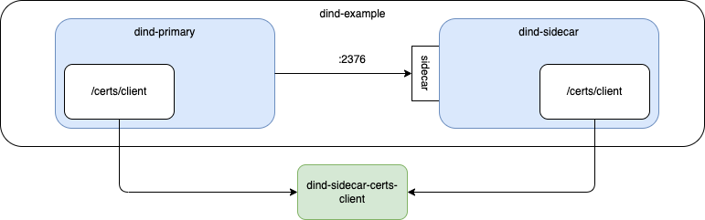

# DinD Example

The purpose of this repository is to explore the Docker-in-Docker (i.e. DinD) technique.

A container (`dind-primary`) is able to access another container (`dind-sidecar`) which has `dockerd` running.

The `dind-sidecar` container is used for Docker workloads in a self-isolated environment.

```bash
$ docker network create dind-example

$ docker run \
    --privileged \
    --name dind-sidecar \
    --detach \
    --network dind-example \
    --network-alias sidecar \
    --env DOCKER_TLS_CERTDIR=/certs \
    --volume dind-sidecar-certs-client:/certs/client \
    docker:28.0.4-dind
```

The `dind-primary` container is used to declare Docker workloads that will be worked on by `dind-sidecar`.

The `dind-primary` container has the Docker CLI installed but no `dockerd`.

It uses the environment variables `DOCKER_HOST`, `DOCKER_CERT_PATH`, and `DOCKER_TLS` to communicate with `dind-sidecar`.

```bash
$ docker run \
    --rm \
    --network dind-example \
    --env DOCKER_HOST=tcp://sidecar:2376 \
    --env DOCKER_CERT_PATH=/certs/client \
    --env DOCKER_TLS=1 \
    --volume dind-sidecar-certs-client:/certs/client:ro \
    dind-primary:1 \
    docker version
```

```bash
$ docker run \
    --rm \
    --network dind-example \
    --env DOCKER_HOST=tcp://sidecar:2376 \
    --env DOCKER_CERT_PATH=/certs/client \
    --env DOCKER_TLS=1 \
    --volume dind-sidecar-certs-client:/certs/client:ro \
    dind-primary:1 \
    devcontainer build \
        --workspace-folder /example \
        --config /example/devcontainer.json \
        --image-name example:1
```

## Diagram



## Takeaways

1. Docker-in-Docker

I found a Datadog [article](https://docs.datadoghq.com/security/default_rules/cis-docker-1.2.0-5.31/) that containers should not mount the Docker socket inside them.

_If the Docker socket is mounted inside a container it could allow processes running within the container to execute Docker commands which would effectively allow for full control of the host._

I found a Docker [article](https://www.docker.com/resources/docker-in-docker-containerized-ci-workflows-dockercon-2023/#:~:text=Docker%2Din%2DDocker%20is%20a,process%20to%20complete%20the%20behavior.) that outlined Docker-in-Docker for containerized CI workdlows.

2. --no-install-recommends

I added this option to the `apt-get install` and it drastically reduced the size of the final Docker image.

`--no-install-recommends` prevents the installation of packages that are recommended but not strictly required.
